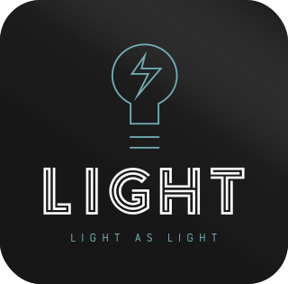

<h1 align="center">
    
</h1>

<b>Light as Light</b> 
Android application to control IOT devices.

  <a href="#about-this-project">About this project</a>&nbsp;&nbsp;&nbsp;&#149;&nbsp;&nbsp;&nbsp;
  <a href="#todo">TODO</a>
  &nbsp;&nbsp;&nbsp;&#149;&nbsp;&nbsp;&nbsp;
  <a href="#next-features">Next Features</a>

## About this project

This project is an android application to setup and control IOT devices over internet and intranet.

## TODO

- Screens

  - [x] Splash
  - [x] Wizard
  - [x] Home with button to switch light
  - [x] Settings menu

- Functions

  - [x] Setup wizard
  - [x] Load configurations on start
  - [x] Send request on light button press
  - [x] Setup refresh button to update light button state
  - [x] Select internet or intranet on switch button (Over internet)
  - [x] Setup settings menu
  - [x] Setup wifi
  - [x] Esp touch protocol
  - [ ] Save DHCP and IP
  - [ ] Refactor code
